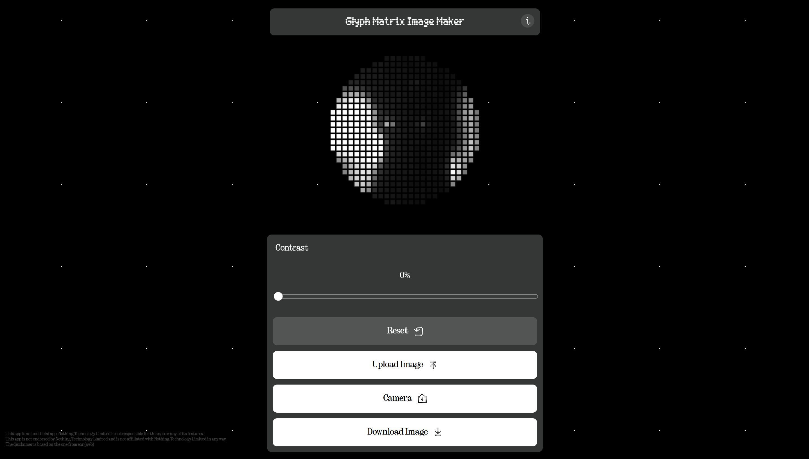

# Glyph Matrix Image Maker

A web application that converts images into glyph matrix patterns. Unlike the original glyph mirror at nothing.tech which only supports webcam capture, this tool allows you to upload custom images and save the generated glyph patterns.

## Features

- **Custom Image Upload**: Upload any image file to convert into a glyph matrix pattern.
- **Webcam Support**: Use your device's camera to use it as a gliph mirror in real-time as on the Nothing Phone 3.
- **Contrast Control**: Adjust the contrast of the generated glyph pattern with a slider
- **Download Functionality**: Save the generated glyph matrix as an image.
- **Privacy Focused**: All image processing happens locally on your device - no data is sent to external servers.
- **Responsive Design**: Works on desktop and mobile devices.

## Usage

1. **Upload an Image**: Click the "Upload Image" button and select an image file from your device.
2. **Use Camera**: Click the "Camera" button to use your device's webcam for real-time image capture.
3. **Adjust Contrast**: Use the contrast slider to fine-tune the visibility of the glyph pattern.
4. **Download**: Click "Download Image" to save the generated glyph matrix as an image.
5. **Reset**: Use the "Reset" button to clear the current image and reset the contrast.

## Technical Details

- Built with vanilla HTML5, CSS3, and JavaScript
- Uses HTML5 Canvas for image processing and rendering
- Supports common image formats (JPEG, PNG, GIF, etc.)
- Generates a 330x330 pixel canvas output
- Features Nothing-inspired typography and design

## Browser Support

- Chrome/Chromium-based browsers (recommended)
- Firefox (untested)
- Safari (untested)

## Privacy

This application processes all images locally on your device. No images or data are uploaded to external servers or stored remotely. The app includes a privacy notice accessible through the info icon in the header.

## Disclaimer

This is an unofficial application. Nothing Technology Limited is not responsible for this app or any of its features. This app is not endorsed by or affiliated with Nothing Technology Limited in any way.

The icons and fonts used in this web app are from Nothing Technology Limited.

## License

This project is licensed under the MIT License - see the [LICENSE](LICENSE) file for details.